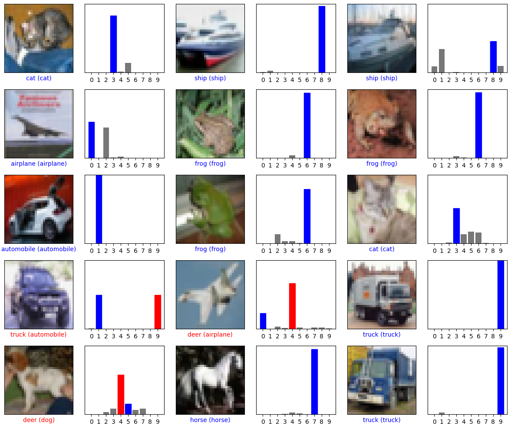

# Image Classifier using CNN

This project is a Convolutional Neural Network (CNN)-based image classifier built using TensorFlow and Keras. It is trained on the CIFAR-10 dataset and can classify images into 10 categories.

## 🚀 Project Overview

- **Dataset**: CIFAR-10  
- **Model**: CNN (Using MobileNetV2 or EfficientNetB0 as a feature extractor)  
- **Framework**: TensorFlow & Keras  
- **Training**: Uses categorical cross-entropy loss & Adam optimizer  

## 📂 Project Structure

```
📦 Image-Classifier-CNN
├── 📄 image_classifier.ipynb  # Jupyter Notebook with training code
├── 📄 my_cnn_model.keras      # Saved trained model
├── 📄 output.png              # Sample output image
├── 📄 .gitignore              # Ignore unnecessary files
└── 📄 README.md               # Project documentation
```

## 📌 Installation & Setup

1. Clone the repository:
   ```sh
   git clone https://github.com/pradipNP/pradipNP-Image-Classifier-CNN.git
   ```
2. Install required dependencies:
   ```sh
   pip install tensorflow numpy matplotlib
   ```
3. Open the Jupyter Notebook:
   ```sh
   jupyter notebook
   ```
4. Run `image_classifier.ipynb` to train & test the model.

## 🎯 Results

The model achieves **XX% accuracy** on the test dataset. Below is a sample classification output:



## 🔗 Repository Link

[GitHub Repository](https://github.com/pradipNP/pradipNP-Image-Classifier-CNN)

---

